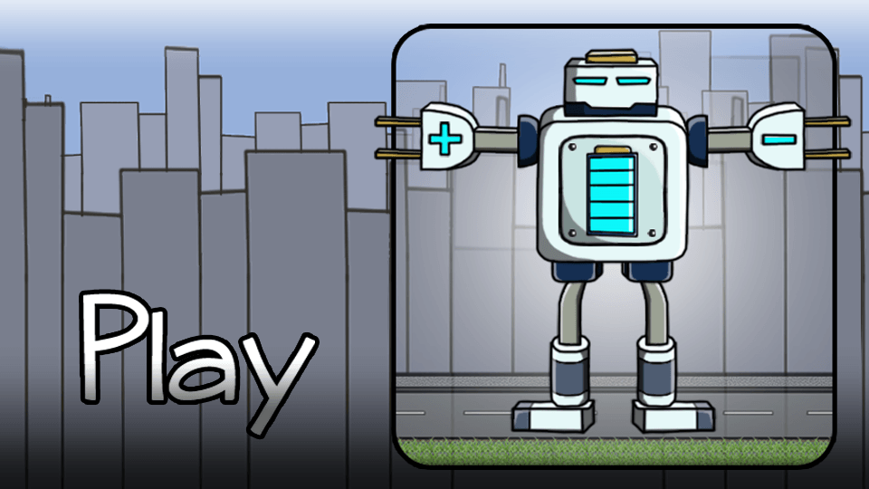
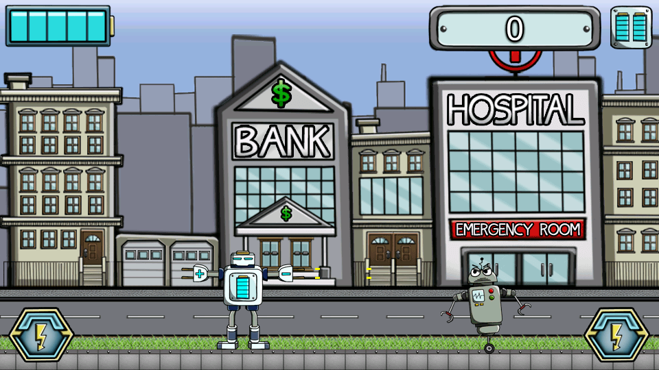

# Android-Game
An android game made in Java with Eclipse. The game was made on an open-source framework from a book called: <i>"Beginning Android Games"</i>. 

All of the in-game assets (found in <b>./assets</b>) and the graphic design was made by Tadej Hiti. 

Currently I'm upgrading the games framework to be up to-date with todays modern standards, using the Libgdx framework. The game is currently in early buld.

<b>Menu screenshot:</b> 

<b>In-game screenshot:</b> 

<b>Main character:</b> 
                         <b>Enemy character:</b> 

